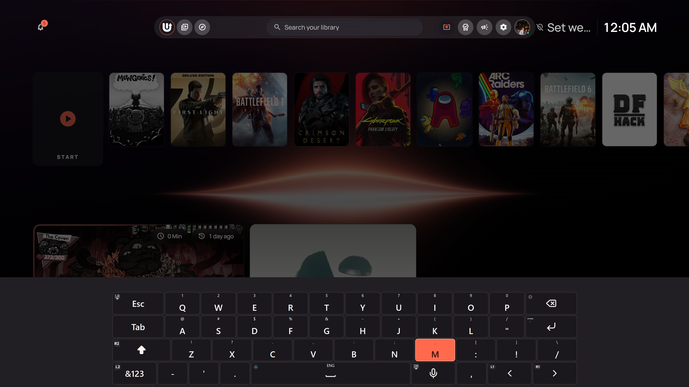

<p align="center">
  
</p>

# Warmup Companion

Native Windows companion package for
[warmUP](https://github.com/warmUP-corp). It gives warmUP controller users a
gamepad-driven virtual keyboard in normal apps, UAC, lock, and sign-in surfaces
where the desktop webview cannot inject input.



## Why It Exists

warmUP is the main app. This package handles the privileged Windows input path:

- Open and drive a native on-screen keyboard with a controller.
- Type into desktop apps and secure Windows surfaces.
- Use local English suggestions without reading text from the focused app.
- Sleep while a game owns the controller, then resume for desktop input.
- Keep the input stack auditable before install.

## Trust Model

This repo is intended to be auditable before install.

- The keyboard injects keys through Win32 `SendInput`.
- It does not read text from the focused application to power suggestions.
- Prediction context is a VK-only buffer: only characters typed by this keyboard
  are used.
- Text prediction is local, English-only prefix completion in userland.
- Predictions are disabled on UAC, lock, and sign-in surfaces.
- A local personal dictionary may be stored under `%LOCALAPPDATA%`, but writes
  are skipped when UI Automation reports the focused field is a password field.
- If password-field detection fails, learning is skipped.
- The app does not send crash telemetry.

The service needs high Windows privileges because secure desktop input is not
available to a normal Tauri/webview process. The installed service is
`WarmupVkSvc`, runs as LocalSystem, and launches a worker into the active console
session.

## Install

### Installer (recommended)

Download `warmup-companion-setup.exe` from the
[latest release](https://github.com/warmUP-corp/warmup-companion/releases/latest),
run it, and approve the UAC prompt. It installs and starts the service and adds
an Add/Remove Programs entry. Silent install is supported:

```powershell
warmup-companion-setup.exe /S
```

### From source (PowerShell)

From an Administrator PowerShell:

```powershell
.\install\Install-WarmupVk.ps1
```

This builds the release binary first, then installs it.

Either path installs:

- service: `WarmupVkSvc`
- binary: `C:\ProgramData\WarmupVk\bin\warmup-companion.exe`
- log: `C:\ProgramData\WarmupVk\service.log`

Then lock Windows or return to the sign-in screen and press the configured
controller VK button.

## Uninstall

If you installed with `warmup-companion-setup.exe`, uninstall from
**Settings -> Apps** (Add/Remove Programs), or run the uninstaller silently:

```powershell
"C:\Program Files\WarmupCompanion\uninstall.exe" /S
```

Otherwise, from an Administrator PowerShell:

```powershell
.\target\release\warmup-companion.exe uninstall
```

or use the tray menu action when the installed companion is running.

## Diagnostics

```powershell
.\install\Collect-WarmupVkDiagnostics.ps1
```

This prints service status, installed binary metadata, recent service logs, and
HID/Winlogon signal lines. Crash dumps, when created, are local files under
`C:\ProgramData\WarmupVk`; do not share them without reviewing contents.

## Standalone Game Sleep

When warmUP is connected, it pushes `gameActive` / `launcherForegroundNav` over
IPC and the companion sleeps the controller loop while the game owns the pad.
Standalone companion builds also detect a foreground fullscreen game-like window
locally using the same warmUP-style fullscreen/window denylist heuristic.
While warmUP is connected over IPC, warmUP owns the mode state and standalone
detection is ignored.

Default: enabled.

```powershell
warmup-companion.exe settings sleep-on-game get
warmup-companion.exe settings sleep-on-game off
warmup-companion.exe settings sleep-on-game on
```

Equivalent config key in `C:\ProgramData\WarmupVk\settings.ini`:

```ini
sleep_on_game=true
```

Legacy `auto_stop_on_game=true` is treated as Guide-only sleep. The controller
loop no longer exits because that would prevent PS/Guide from waking warmUP.

## Build

```powershell
cargo build --release
cargo check
```

Feature defaults include the Windows service and gamepad support.

## Architecture Notes

- [Domain glossary](CONTEXT.md)
- [Local prediction ADR](docs/adr/0001-local-prediction-sendinput.md)
- [Companion input authority ADR](docs/adr/0002-companion-gamepad-input-authority.md)
- [IPC protocol](docs/companion-ipc-protocol.md)
