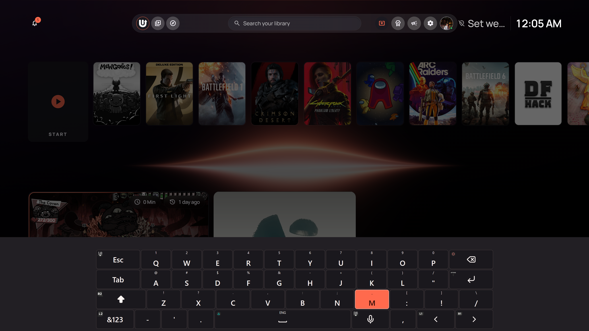
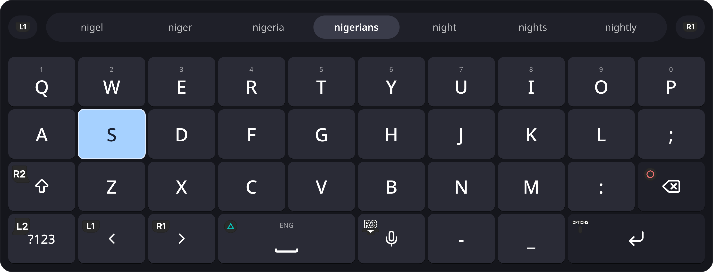
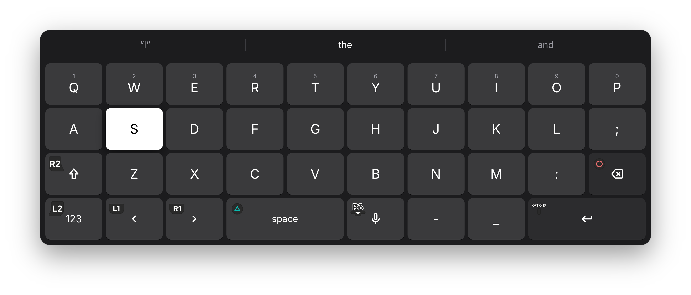
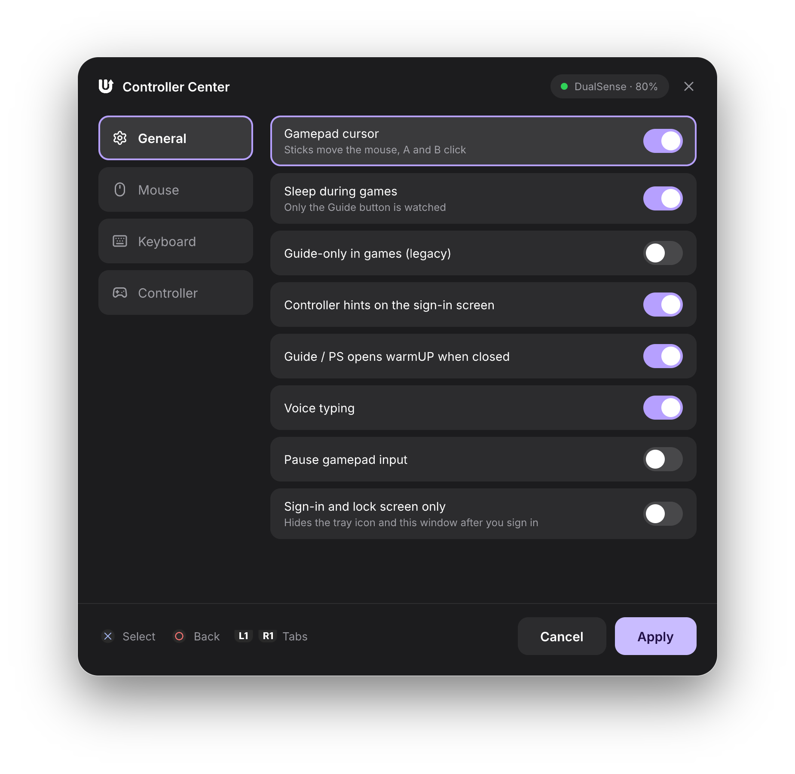
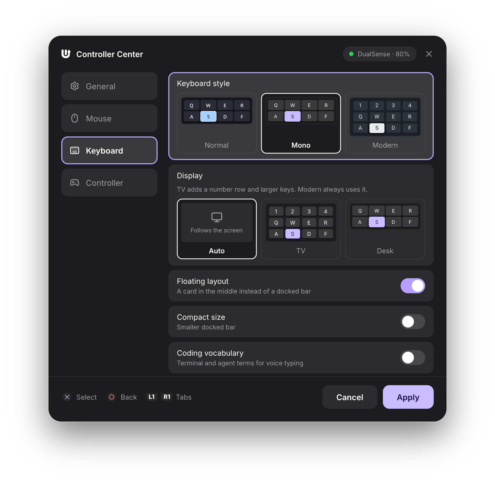
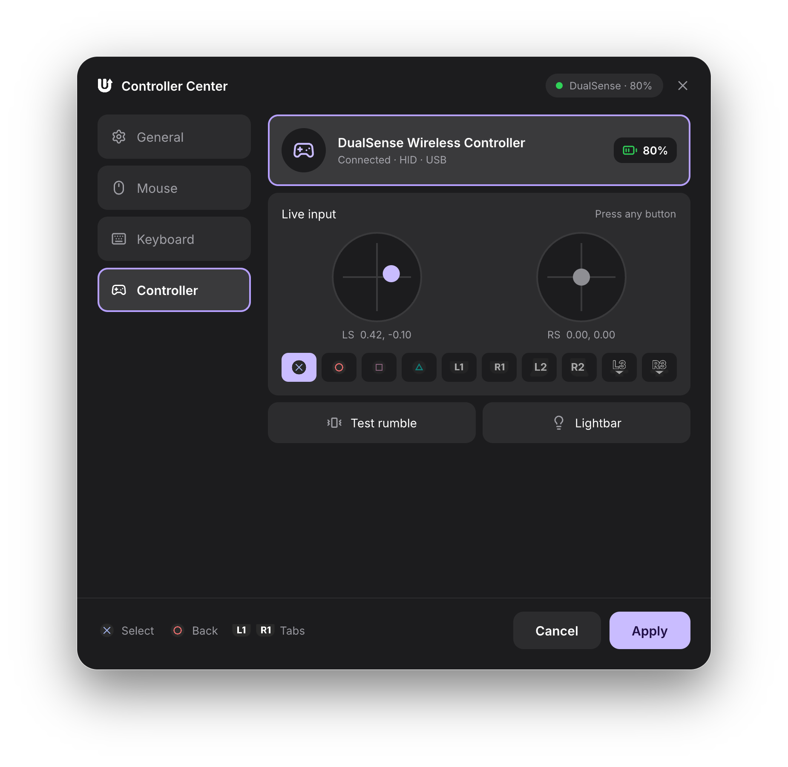
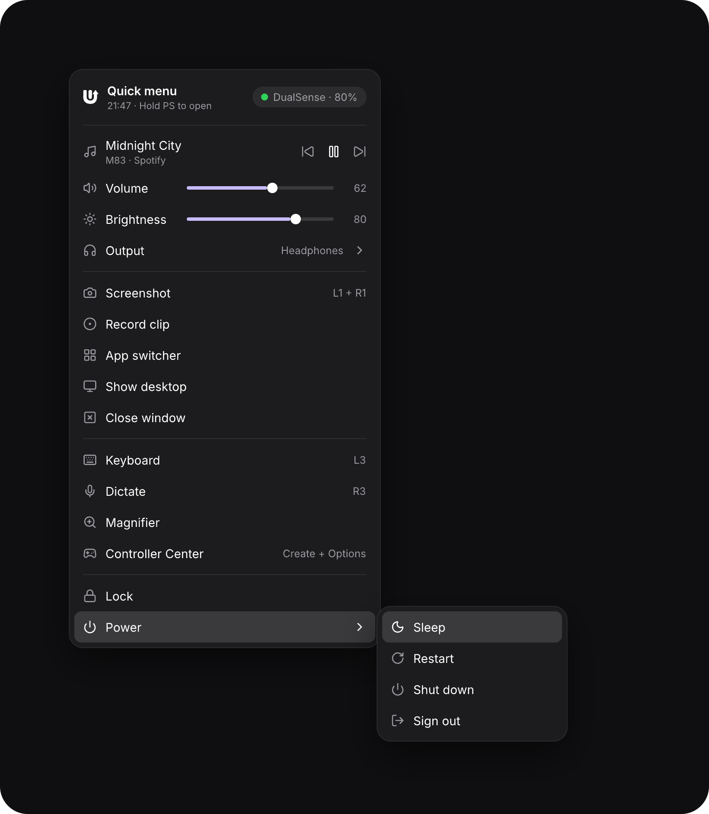
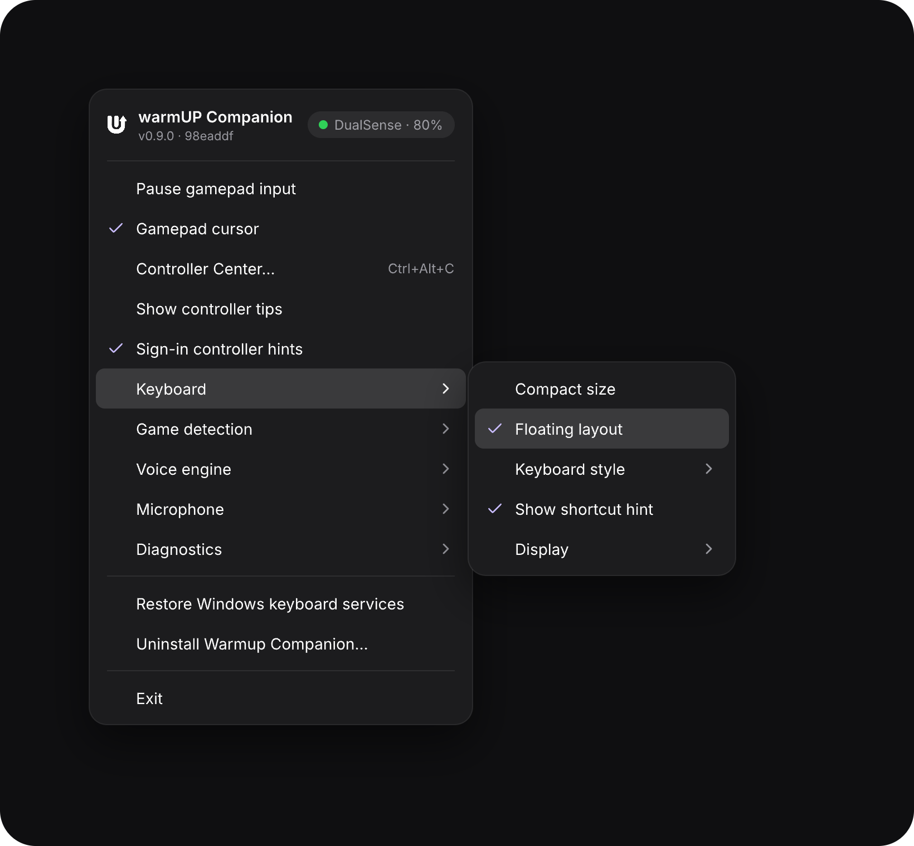
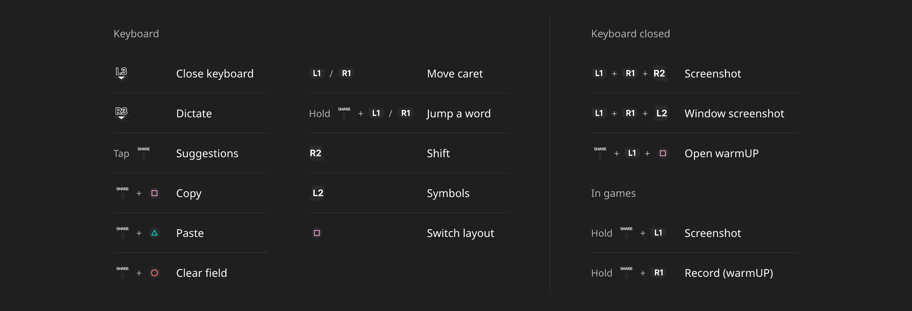

<p align="center">
  
</p>

# warmUP Companion

Type anywhere in Windows with the controller already in your hands. warmUP Companion is an open-source controller keyboard for Xbox and PlayStation controllers, including desktop apps, UAC prompts, the lock screen, and sign-in screen.

[Download for Windows](https://github.com/warmUP-corp/warmup-companion/releases/latest)
· [Join the Discord](https://discord.gg/z2zmB4v2Bn)
· [Report a problem or idea](https://github.com/warmUP-corp/warmup-companion/issues/new/choose)
· [warmUP Game Launcher](https://www.warmup-gamelauncher.com/)

## Features

- Works on Windows without Steam or the warmUP Game Launcher.
- Opens a native on-screen keyboard and shows Xbox or PlayStation button hints.
- Types into desktop apps, UAC prompts, lock screens, and sign-in screens.
- Offers local English word suggestions without reading text from the focused app.
- Supports optional offline voice typing with Whisper.cpp or NVIDIA Parakeet.
- Sleeps controller input while a game is active, then wakes for desktop use.
- Quick menu on a long press of PS / Guide: volume, brightness, media, screenshot, app switcher, lock and power.
- Controller Center to change every setting with the controller, mouse or keyboard.
- Uses the DualSense / DualShock 4 touchpad as a trackpad: tap to click, two-finger scroll, desktop swipes.



<sub>Press L3 (left-stick click) to open the keyboard.</sub>

| Normal | Mono |
| --- | --- |
|  |  |

### Controller Center

Hold **Create + Options** (View + Menu on Xbox) or press **Ctrl+Alt+C** to open it. While it is open the controller only drives this window.

| General | Keyboard | Controller |
| --- | --- | --- |
|  |  |  |

### Quick menu and tray

| Quick menu (hold PS / Guide) | Tray menu |
| --- | --- |
|  |  |

---

## Installation

1. Download `warmup-companion-setup.exe` from the [latest release](https://github.com/warmUP-corp/warmup-companion/releases/latest).
2. Run it and approve the UAC prompt. The installer adds the Windows service required for secure Windows surfaces.
3. Connect a controller and press **L3** to open the keyboard.

No Steam setup is required. To try the sign-in path after confirming normal desktop typing, press `Win+L` and use the controller from the lock screen.

### Supported controllers

- Xbox 360 and Xbox One-family controllers
- PlayStation DualShock 4
- PlayStation DualSense and DualSense Edge
- Other compatible HID gamepads recognized through the controller mapping database

## Controller controls



### Keyboard closed

| Xbox | PlayStation | Action |
| --- | --- | --- |
| Left stick | Left stick | Move the mouse pointer |
| Right stick | Right stick | Scroll |
|  |  | Click |
|  |  | Open the keyboard |
| Hold Guide | Hold PS | Quick menu |
|  +  |  +  | Open or close the Controller Center |
| – | Touchpad tap / two-finger tap | Left click / right click |
| – | Touchpad two-finger drag | Scroll |
| – | Hold touchpad click + swipe | Switch desktop (left/right), Task View (up), show desktop (down) |

### Keyboard open

| Xbox | PlayStation | Action |
| --- | --- | --- |
| D-pad or left stick | D-pad or left stick | Move keyboard focus |
|  |  or touchpad | Type the selected key |
|  |  | Backspace |
|  |  | Switch keyboard language/layout |
|  |  | Space |
|  |  | Enter |
|  |  | Focus and advance word suggestions |
|  /  |  /  | Cycle word suggestions |
|  +  /  /  |  +  /  /  | Copy / paste / clear the focused input |
|  |  | Symbols |
|  |  | Shift |
|  |  | Close the keyboard |
|  |  | Start or stop optional voice typing |

## Settings

| Setting | Default | What it does |
| --- | --- | --- |
| Sign-in only | Off | Runs the companion only on the sign-in and lock screen (`run_mode = signin`). After you sign in or unlock, its worker process exits and the service idles with no input, tray or voice engine until you lock the PC again. To reach the tray and Controller Center while it sleeps, open **Warmup Companion** from the Start menu (or run `warmup-companion.exe wake`); it stays awake until the next sign-in or unlock. |
| Guide opens warmUP | On | Pressing Guide (Xbox) or PS (PlayStation) while warmUP is closed starts it. If warmUP is already open nothing changes, repeat presses during startup are ignored, and it never fires on the sign-in screen. Turn off with `guide_launch = false` or in the Controller Center. |
| Game sleep | On | Stops companion mouse and keyboard input while a fullscreen game is active. Press Guide or PS to wake it. |
| Voice typing | On, once installed | Uses an optional local speech engine on the normal desktop. It is unavailable on lock and sign-in screens. Turn it off completely in the tray (Voice typing), in Controller Center under General, or with `voice_enabled = false` in `settings.ini`. R3, Ctrl+Alt+V and the mic key then do nothing, the mic key on the keyboard shows disabled, and the speech engine unloads. |
| Dictation vocabulary | Coding | Primes voice typing with terminal and coding-agent terms (git, npm, Claude Code, herdr, …) and fixes common mishearings. Add your own comma-separated words in the Controller Center, or set `vocabulary = off` in `settings.ini`. |
| Suggestions | On | Keeps a local, English-only prefix buffer from characters typed by the companion. |
| Touchpad gestures | On | Tap to click, two-finger scroll and desktop swipes on the DualSense / DualShock 4 touchpad (`touchpad_gestures`, `touchpad_tap_click`). |

Change settings in the Controller Center (tray icon, Create + Options, or Ctrl+Alt+C). It can also export, import and reset all settings; import and reset back up `settings.ini` first. Use the tray icon to check status and privacy settings. To manage game sleep from a terminal:

```powershell
warmup-companion.exe settings sleep-on-game get
warmup-companion.exe settings sleep-on-game off
warmup-companion.exe settings sleep-on-game on
```

## Privacy and security

- Key input is injected through Win32 `SendInput`.
- Suggestions do not read the text in the focused application. They only use characters typed by this keyboard.
- Suggestions and learning are disabled on UAC, lock, and sign-in surfaces.
- Personal-dictionary writes are skipped for password fields. If password detection fails, learning is skipped.
- Crash telemetry is off unless `WARMUP_SENTRY_DSN` is explicitly set. Local crash dumps are never uploaded.

The service runs as `WarmupVkSvc` under LocalSystem because secure-desktop input is not available to a normal desktop application. Read the [privacy policy](PRIVACY.md) and [security policy](SECURITY.md) before installing.

## Advanced installation and diagnostics

### From source

From an Administrator PowerShell:

```powershell
.\install\Install-WarmupVk.ps1
```

This builds the release binary, installs `WarmupVkSvc`, and writes logs to `C:\ProgramData\WarmupVk\service.log`.

### Uninstall

If you used the installer, remove **warmUP Companion** in **Settings > Apps**, or run:

```powershell
"C:\Program Files\WarmupCompanion\uninstall.exe" /S
```

For a source install, run this from an Administrator PowerShell:

```powershell
.\target\release\warmup-companion.exe uninstall
```

### Diagnostics

```powershell
.\install\Collect-WarmupVkDiagnostics.ps1
```

The report includes service status, installed binary metadata, recent service logs, and HID/Winlogon signal lines. Review local crash dumps before sharing them.

## Build

```powershell
cargo build --release
cargo check
```

- [Contributing](CONTRIBUTING.md)
- [Domain glossary](CONTEXT.md)
- [IPC protocol](docs/companion-ipc-protocol.md)
- [Release process](docs/RELEASES.md)
